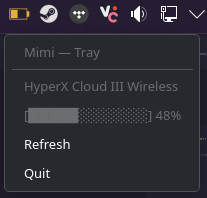

<div align="center">
  
  <h3><bold>Mimi</bold></h3>
</div>
<br>

**Mimi** — Headphone tray icon

rust rewrite of [hyperx-battery-reader](https://github.com/durpyneko/hyperx-battery-reader/)



### DE(s) supported

- KDE Plasma

### Devices supported

- HyperX Cloud III Wireless

### Setup

<details>
<summary>Click to expand</summary>
<br>

Add udev rule
```bash
sudo nano /etc/udev/rules.d/99-mimi.rules
```

with content (e.g. HyperX Cloud III Wireless)
```conf
SUBSYSTEM=="hidraw", ATTRS{idVendor}=="03f0", ATTRS{idProduct}=="05b7", MODE="0666", TAG+="uaccess"
```

Reload udev
```bash
sudo udevadm control --reload && sudo udevadm trigger
```

Build
```bash
cargo build --release
```

Copy
```bash
cp target/release/mimi ~/mimi
```

Create service
```bash
nano ~/.config/systemd/user/mimi.service
```

with content
```conf
[Unit]
Description=Mimi - HyperX tray icon
# Wait for the graphical session (D-Bus, Wayland, SNI watcher) to be ready
After=graphical-session.target
PartOf=graphical-session.target

[Service]
Type=simple
ExecStart=%h/mimi
Restart=on-failure
RestartSec=5s

[Install]
WantedBy=graphical-session.target
```

Enable and start service
```bash
systemctl --user start --now mimi.service
```

</details>

### TODO(s)

- [ ] Split modularly
- [x] Force refresh
- [ ] RPC (Self update, more...)
- [ ] Support other platforms
- [ ] Support other devices